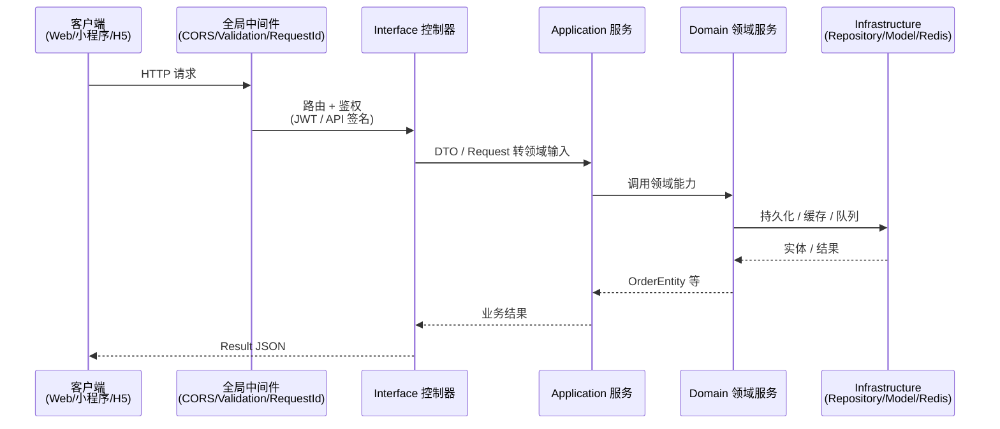
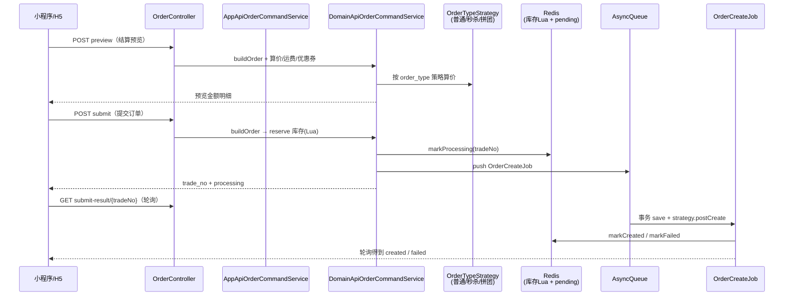
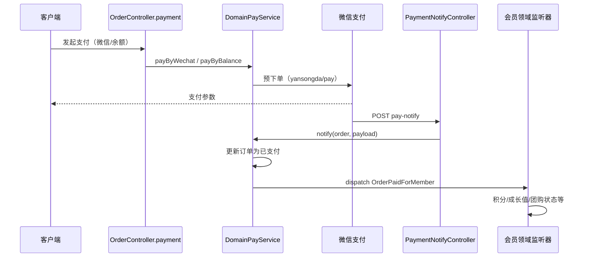
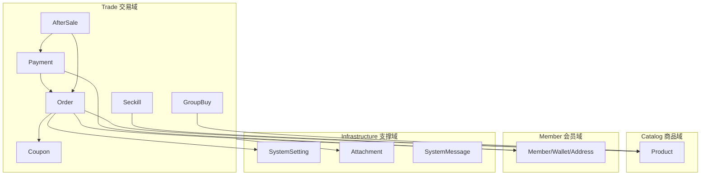

# MineShop 项目架构介绍

> MineShop 是一款基于 **MineAdmin** 与 **Hyperf** 构建的高性能 B2C 商城系统，采用 **DDD（领域驱动设计）** 分层架构，面向中小企业与个人开发者提供商品、订单、会员、营销、支付等完整电商能力。本文档从目录结构、技术栈、核心业务流程与模块依赖四个维度说明整体架构。

---

## 一、项目概览

| 维度 | 说明 |
|------|------|
| 项目名称 | MineShop（`hyperf-mine-shop`） |
| 基础框架 | [MineAdmin](https://www.mineadmin.com) 3.x + [Hyperf](https://hyperf.io) 3.1 |
| 架构风格 | 后端 DDD 四层 + 多端前端（管理后台 / 小程序 / H5） |
| 运行模式 | Swoole 协程常驻进程，HTTP 默认端口 `9501` |
| 当前状态 | 开发阶段，README 明确不建议直接用于生产 |

系统由 **单体 Hyperf 后端** 统一对外提供两套 API：

- **Admin API**（`/admin/*`）：后台运营管理
- **C 端 API**（`/api/v1/*`）：小程序 / H5 商城

---

## 二、目录结构与模块划分

### 2.1 仓库根目录

```
hyperf-mine-shop/
├── app/                    # 后端应用（DDD 核心）
├── config/                 # Hyperf / MineAdmin 配置
├── databases/              # 数据库迁移与种子
├── storage/                # 运行时存储、语言包等
├── bin/                    # hyperf 命令行入口
├── helper/                 # 全局辅助函数
├── plugins/                # 后端可插拔插件（微信、物流、导出、短信等）
├── tests/                  # PHPUnit 单元测试
├── web/                    # 后台管理前端（Vue 3 + Vite）
├── miniprogram/            # C 端（Taro：微信小程序 + H5）
├── docker-compose.yml      # 本地 MySQL / Redis / Hyperf 开发环境
├── composer.json           # PHP 依赖
└── 项目介绍.md              # 本文档
```

### 2.2 后端 `app/` — DDD 四层

```
app/
├── Interface/          # 接口层：HTTP 入口、DTO、Request 校验、Transformer
│   ├── Admin/          # 后台控制器（/admin/*）
│   ├── Api/            # C 端控制器（/api/v1/*）
│   └── Common/         # 公共控制器、中间件、统一响应 Result
├── Application/        # 应用层：编排领域服务，区分 Admin / Api 场景
│   ├── Admin/          # 后台 Command / Query 应用服务
│   └── Api/            # C 端应用服务
├── Domain/             # 领域层：实体、值对象、领域服务、仓储接口、领域事件
└── Infrastructure/     # 基础设施层：Eloquent Model、仓储实现、异常、定时任务、Lua 脚本
```

**各层职责：**

| 层级 | 职责 | 典型内容 |
|------|------|----------|
| **Interface** | 适配 HTTP，参数校验，鉴权中间件，响应序列化 | `OrderController`、`TokenMiddleware`、`OrderPreviewRequest` |
| **Application** | 用例编排，不含核心业务规则 | `AppApiOrderCommandService`、`AppOrderQueryService` |
| **Domain** | 业务规则、聚合、策略、领域事件 | `DomainApiOrderCommandService`、`OrderEntity`、`NormalOrderStrategy` |
| **Infrastructure** | 技术实现：DB、Redis、支付 SDK、文件存储 | `Order` Model、`OrderRepository`、`YsdPayService` |

路由通过 Hyperf **注解路由** 注册（`#[Controller]`、`#[GetMapping]` 等），`config/routes.php` 仅保留欢迎页等少量静态路由。

### 2.3 领域模块（`app/Domain/`）

按 **限界上下文（Bounded Context）** 划分：

| 领域包 | 子模块 | 职责 |
|--------|--------|------|
| **Catalog** | Product、Brand | 商品、SKU、分类、品牌、库存与快照 |
| **Trade** | Order、Payment、Coupon、Seckill、GroupBuy、Shipping、AfterSale、Review | 交易全链路：下单、支付、优惠、秒杀、拼团、运费、售后、评价 |
| **Member** | — | 会员档案、地址、钱包、等级、成长值、标签 |
| **Auth** | — | 登录认证抽象 |
| **Permission** | — | 后台用户、角色、菜单、数据权限（MineAdmin 能力） |
| **Organization** | Department、Position、Leader | 组织架构 |
| **Infrastructure** | SystemSetting、Attachment、AuditLog、SystemMessage、Statistics、Geo | 系统设置、附件、日志、站内信、统计看板、行政区划 |

### 2.4 后台前端 `web/`

基于 **MineAdmin UI**，按业务模块组织：

```
web/src/
├── bootstrap.ts          # 应用启动：Provider、Pinia、Router、插件、i18n
├── provider/             # 全局配置、字典等 Provider
├── router/               # 路由（静态 + 动态菜单）
├── store/                # Pinia 状态（用户、路由、Tab、字典等）
├── layouts/              # 经典后台布局（侧栏、顶栏、标签页）
├── modules/              # 业务模块
│   ├── base/             # 登录、权限、日志、仪表盘、附件
│   ├── mall/             # 商城：商品、订单、优惠券、秒杀、拼团、售后等
│   ├── member/           # 会员列表、积分等
│   ├── system/           # 系统配置
│   └── geo/              # 地区数据
├── plugins/              # 前端插件（导出中心、系统消息、MineAdmin 组件库）
└── components/           # 通用业务组件
```

### 2.5 C 端 `miniprogram/`

使用 **Taro 4 + React 18**，一套代码编译为 **微信小程序** 与 **H5**：

```
miniprogram/src/
├── pages/                # 页面：首页、分类、购物车、商品详情、下单、支付、售后等
├── services/             # API 封装（含签名、Token、驼峰/蛇形转换）
├── components/           # 公共组件
├── common/               # 鉴权、平台判断
└── config/               # API 地址、签名客户端配置
```

主要 Tab：**首页 / 分类 / 购物车 / 我的**。

### 2.6 数据库与插件

- **`databases/migrations/`**：约 60+ 张表迁移，涵盖 `mall_*` 商城表与 MineAdmin 权限、消息、导出等表。
- **`plugins/`**：后端插件化扩展
  - `wechat`：微信小程序 / 公众号
  - `express`：物流轨迹（如快递100）
  - `export-center`：异步导出
  - `sms`：短信验证

---

## 三、主要技术栈与框架

### 3.1 后端

| 类别 | 技术 | 版本/说明 |
|------|------|-----------|
| 语言 | PHP | >= 8.2 |
| 框架 | Hyperf | 3.1.*（协程、DI、注解、异步队列） |
| 运行时 | Swoole | >= 5.0 |
| 基础能力 | mineadmin/core、auth-jwt、upload、access | ~3.0 |
| ORM | hyperf/database | 类 Laravel Eloquent |
| 缓存/队列 | Redis + hyperf/async-queue | 订单异步创建、导出任务等 |
| 支付 | yansongda/pay | 微信支付等 |
| 微信 | w7corp/easywechat | 小程序登录、支付 |
| 对象存储 | hyperf/flysystem-oss、七牛 | 附件上传 |
| 校验/DTO | hyperf/validation、tangwei/dto | FormRequest + DTO |
| 定时任务 | hyperf/crontab | 订单自动关闭、团购状态、地区同步等 |

### 3.2 后台管理前端（`web/`）

| 类别 | 技术 |
|------|------|
| 框架 | Vue 3.5 + TypeScript |
| 构建 | Vite 7 |
| UI | Element Plus 2.x |
| 状态 | Pinia 3 |
| 路由 | Vue Router 4 |
| 表格/表单 | @mineadmin/pro-table、@mineadmin/form |
| 样式 | UnoCSS、SCSS |
| 图表 | ECharts |
| 国际化 | vue-i18n |

### 3.3 C 端（`miniprogram/`）

| 类别 | 技术 |
|------|------|
| 跨端 | Taro 4.1 |
| UI 库 | NutUI React Taro |
| 语言 | TypeScript + React 18 |
| 目标端 | 微信小程序（weapp）、H5 |

### 3.4 基础设施

| 组件 | 用途 |
|------|------|
| MySQL 8 | 主数据存储 |
| Redis | 缓存、异步队列、秒杀/下单库存 Lua、下单 pending 状态 |
| Docker Compose | 本地 `mysql:3309`、`redis:6380`、`hyperf:9501` |

---

## 四、核心业务流程与数据流向

### 4.1 请求链路（通用）



**鉴权差异：**

- **Admin**：MineAdmin JWT + 角色/菜单/数据权限（`mineadmin/access`）
- **Api**：`TokenMiddleware`（会员 JWT）+ `ApiSignatureMiddleware`（请求签名，防篡改）

### 4.2 商品浏览

```
小程序/H5 → GET /api/v1/product/*、category/*
         → AppApiProductQueryService
         → Domain 商品查询 + ProductSnapshot（缓存快照）
         → ProductRepository → mall_products / mall_product_skus
```

后台商品维护走 Admin 链路：`AppProductCommandService` → `DomainProductService` → 写库并触发 `ProductCreated` 等事件（库存监听、快照刷新）。

### 4.3 下单流程（核心）

C 端采用 **「同步校验 + Lua 扣库存 + 异步入库」** 模式，降低高并发下数据库压力。



**订单类型策略（策略模式）：**

| 类型 | 策略类 | 说明 |
|------|--------|------|
| `normal` | `NormalOrderStrategy` | 普通购物车/直购 |
| `seckill` | `SeckillOrderStrategy` | 秒杀场次、独立库存 Key |
| `group_buy` | `GroupBuyOrderStrategy` | 拼团活动、成团逻辑 |

策略在 `config/autoload/dependencies.php` 中注入 `OrderTypeStrategyFactory`，支持插件动态 `register()`。

**失败回滚：** `OrderCreateJob::fail()` 调用 `DomainOrderStockService::rollback()` 回滚 Redis 库存，并标记 pending 失败。

### 4.4 支付流程



支付成功后通过领域事件驱动：

- `PurchaseRewardListener`：消费返积分、成长值
- `GroupBuyOrderPaidListener`：拼团订单状态同步
- `OrderStatusNotifyListener`：订单状态消息推送

余额支付走 `DomainMemberWalletService`，涉及钱包流水与冻结记录表。

### 4.5 发货、收货与售后

| 阶段 | 后台 | C 端 | 领域要点 |
|------|------|------|----------|
| 发货 | Admin `OrderController` ship | — | `DomainOrderService::ship`，写包裹、物流单号 |
| 确认收货 | — | Api confirmReceipt | 订单完成，触发后续结算 |
| 售后 | Admin 审核/退款/重发 | Api 申请/填写物流 | `DomainAfterSaleService`，退款回调 `PaymentNotifyController::refundNotify` |

定时任务（`app/Infrastructure/Crontab/`）例如 **订单超时自动关闭**、**团购活动状态**、**地区数据同步**。

### 4.6 营销子域数据流

| 能力 | 关键表/缓存 | 流程要点 |
|------|-------------|----------|
| **优惠券** | `mall_coupons`、`mall_coupon_users` | 领取、下单抵扣、`CouponServiceAdapter` |
| **秒杀** | `mall_seckill_*`、Redis Lua | 场次 + 活动商品库存，独立 `SeckillOrderStrategy` |
| **拼团** | `mall_group_buys`、`mall_group_buy_orders` | 支付后 `GroupBuyOrderPaidListener` 更新团状态 |
| **运费** | `mall_shipping_templates` | `FreightServiceAdapter` 按模板计费 |

### 4.7 后台管理数据流

```
Vue 页面 → modules/*/api/*.ts (axios)
        → /admin/* 接口
        → Application/Admin/*Service
        → Domain/*Service
        → Infrastructure Repository
```

动态菜单与按钮权限由 MineAdmin 权限模块返回，前端通过 `directives/permission` 与路由守卫控制可见性。

### 4.8 事件驱动（解耦横切逻辑）

`config/autoload/listeners.php` 注册的核心监听器：

| 监听器 | 触发 | 作用 |
|--------|------|------|
| `OrderCreatedListener` | 订单创建 | 记录订单日志 |
| `PurchaseRewardListener` | 支付完成 | 积分、成长值 |
| `LevelUpgradeListener` | 成长值变动 | 会员等级升降 |
| `ProductSkuStockListener` | 库存变更 | SKU 库存同步 |
| `GroupBuyOrderPaidListener` | 支付完成 | 拼团状态 |
| `OrderStatusNotifyListener` | 状态变更 | 消息通知 |

领域事件 + Hyperf `event()` 实现 **同步侧效应**；耗时任务走 **AsyncQueue**（如 `OrderCreateJob`、`ProcessExportJob`）。

---

## 五、各模块之间的依赖关系

### 5.1 后端依赖层次（自上而下）

```
┌─────────────────────────────────────────────────────────┐
│  Interface (Admin / Api Controllers, Middleware)        │
└──────────────────────────┬──────────────────────────────┘
                           │ 仅依赖
                           ▼
┌─────────────────────────────────────────────────────────┐
│  Application (App*CommandService / App*QueryService)    │
└──────────────────────────┬──────────────────────────────┘
                           │ 编排
                           ▼
┌─────────────────────────────────────────────────────────┐
│  Domain (Entity, DomainService, Repository 接口, Event) │
└──────────────────────────┬──────────────────────────────┘
                           │ 接口由下层实现
                           ▼
┌─────────────────────────────────────────────────────────┐
│  Infrastructure (Model, Repository 实现, Pay, Lua, Job) │
└──────────────────────────┬──────────────────────────────┘
                           │
                           ▼
              MySQL / Redis / 外部 SDK（微信、OSS、物流）
```

**依赖原则：**

- Domain **不依赖** Infrastructure 具体实现（通过 Repository 抽象与 Hyperf 容器注入）
- Interface **不直接** 调用 Repository，经 Application 或 Domain 门面进入
- 跨领域协作优先使用 **领域事件** 或 **显式 Domain Service 调用**，避免 Controller 内拼装过多逻辑

### 5.2 领域间依赖（业务向）



- **Trade → Catalog**：下单读取 SKU、价格、库存
- **Trade → Member**：地址、钱包支付、支付后积分/等级
- **Trade → Infrastructure/SystemSetting**：商城配置（支付开关、订单超时、运费规则）
- **Permission / Organization**：主要服务 **Admin 后台**，与 C 端 Member 体系分离（后台 `user` 表 vs 商城 `mall_members`）

### 5.3 前端对后端的依赖

| 端 | API 前缀 | 依赖的后端模块 |
|----|----------|----------------|
| `web/` | `/admin/*` | Permission、Catalog、Trade、Member、Infrastructure 全套管理能力 |
| `miniprogram/` | `/api/v1/*` | Api 应用服务 + 签名/会员 Token |
| 插件 UI | 随插件挂载 | `export-center`、`system-message` 对应 Admin 接口 |

### 5.4 外部系统依赖

| 外部能力 | 集成位置 |
|----------|----------|
| 微信支付 | `DomainPayService`、`YsdPayService`、`plugins/wechat` |
| 微信登录 | `Infrastructure/Service/Wechat/MiniAppAuthService` |
| 对象存储 | `mineadmin/upload`、OSS/七牛配置 |
| 物流查询 | `plugins/express`、`AppApiLogisticsTrackingQueryService` |
| 短信 | `plugins/sms`、`overtrue/easy-sms` |

---

## 六、数据存储概览

### 6.1 商城核心表（节选）

| 表前缀/名称 | 用途 |
|-------------|------|
| `mall_products` / `mall_product_skus` | 商品与规格库存 |
| `mall_categories` / `mall_brands` | 分类、品牌 |
| `mall_orders` / `mall_order_items` | 订单主表与明细 |
| `mall_order_addresses` / `mall_order_packages` | 收货地址、发货包裹 |
| `mall_payments` / `mall_payment_refunds` | 支付与退款 |
| `mall_members` / `mall_wallets` | 会员与钱包 |
| `mall_coupons` / `mall_coupon_users` | 优惠券 |
| `mall_seckill_*` | 秒杀活动、场次、商品 |
| `mall_group_buys` / `mall_group_buy_orders` | 拼团 |
| `mall_settings` | 商城 JSON 配置（支付、物流、会员规则等） |
| `mall_reviews` | 商品评价 |
| `after_sale` 相关 | 售后单（迁移 `2026_03_16_*`） |

### 6.2 权限与系统表（MineAdmin）

`user`、`role`、`menu`、`department`、操作/登录日志、系统消息、导出任务等。

### 6.3 Redis 使用场景

- 异步队列 Channel：`{queue}`
- 下单 pending 状态：`OrderPendingCacheService`
- 库存扣减/回滚：Lua 脚本（`Infrastructure/Library/Lua/`）
- 秒杀专用脚本：`Lua/Seckill/`
- 模型缓存：`hyperf/model-cache`（按需）

---

## 七、部署与本地开发

1. **环境**：PHP 8.2+、Swoole 5+、Composer、Node 20+、MySQL 5.7+/8、Redis 4+
2. **后端**：`composer install` → 配置 `.env` → `php bin/hyperf.php migrate` → `php bin/hyperf.php start`（或 `composer dev` 热重载）
3. **后台**：`cd web && npm install && npm run dev`（默认 Vite 开发服）
4. **小程序**：`cd miniprogram && npm install && npm run dev:weapp` / `dev:h5`
5. **Docker**：`docker-compose up` 提供 MySQL、Redis；Hyperf 容器需挂载代码后手动启动服务

---

## 八、架构特点小结

1. **DDD 分层清晰**：Interface → Application → Domain → Infrastructure，业务规则集中在 Domain。
2. **订单策略可扩展**：普通 / 秒杀 / 拼团通过 `OrderTypeStrategyFactory` 切换，插件可注册新类型。
3. **高并发友好下单**：同步 Lua 扣库存 + 异步 `OrderCreateJob` 入库 + 前端轮询结果。
4. **事件驱动副作用**：支付、库存、等级、消息等与主流程解耦。
5. **多端统一后端**：Admin 与 Api 分离应用服务，共享领域模型。
6. **MineAdmin 生态**：权限、上传、JWT、插件市场能力可复用，降低后台建设成本。

---

## 九、相关链接

- 官网 / 文档：https://mineshop.club  
- 演示后台：https://demo.mineshop.club  
- Hyperf 文档：https://hyperf.wiki/3.0/  
- MineAdmin：https://www.mineadmin.com  

---

*文档根据仓库当前代码结构整理，若模块持续迭代，请以 `app/Domain`、`app/Application` 及迁移文件为准。*
